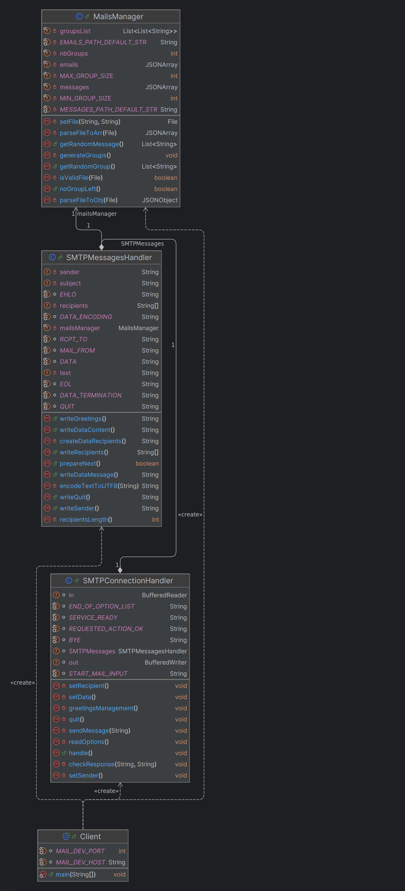

# Email Pranking App

This repo contains a client application that sends prank emails to a list of email addresses.

## Description

Using the Java Socket API and a client-side, simplified implementation of the SMTP protocol, the
purpose of this program is to send prank emails to a selected list of email addresses. The emails
to be sent and the list of addresses are easily accessible and editable inside json files.

## Getting started

### Execution flow

The program should receive : 

- A list of email addresses stored in the emails.json file

- A number of groups to form with the given addresses, also stored in the emails.json file. The
    program will try to form groups of 2 to 5 addresses, depending on the number of given addrsses
    and the number of groups. Addresses may only be part of one group.

- A list of emails, formatted as follows :

        "subject": "TU as besoin d'argent et TU peux en GAGNER",
        "body": "Oui, toi! Oui tu veux de l'argent! Alors participe et clique sur ce lien."

The program will then randomly choose one address from each group to be used as the email's sender, and
one message per group. One email is then sent for each group, using the remaining addresses as recipients.

### Configuration

Configuration should be pretty easy, as mentioned above. You can find the email configuration file [here](src/main/java/rgborgeaud_Svelva/ch/dai/lab/smtp/Client/Config/emails.json),
and the messages configuration file [here](src/main/java/rgborgeaud_Svelva/ch/dai/lab/smtp/Client/Config/messages.json).
Simply add or remove what you need !

The SMTP server's IP and port may also be configured inside the [Client class](src/main/java/rgborgeaud_Svelva/ch/dai/lab/smtp/Client/Client.java),
although we do not recommend using this program with a real SMTP server.

### Mock server configuration

We recommend using the docker [Maildev](https://github.com/maildev/maildev) docker image.
Once it is installed, simply run 

    docker run -d -p 1080:1080 -p 1025:1025 maildev/maildev

The interface is then accessible in any web browser at [localhost:1080](http://localhost:1080/).

## Detailed implementation

Our program uses 4 main classes :

1) **Client**

This is where the main() method is. The purpose of this class is to create the socket and its output and input streams.
The Client class is also where all 3 other classes are created. SMTPConnectionHandler receives both streams and the SMTPMessagesHandler
from the Client, and SMTPMessagesHandler receives the MailManager.

2) **MailsManager**

This class uses the config files to create groups, select random groups and select random messages. It also checks
whether the email addresses are correctly formatted. 

3) **SMPTMessagesHandler**

The SMTPMessagesHandler class is used to generate correctly formatted SMTP messages using the email addresses and messages
fed by MailsManager. 

4) **SMTPConnectionHandler**

Handles communication between the Client and the Server. Reads and checks server's responses, sends messages formatted by
SMTPMessageshandler. The handle() methods shows the whole SMTP protocol flow. 

### Class diagram

